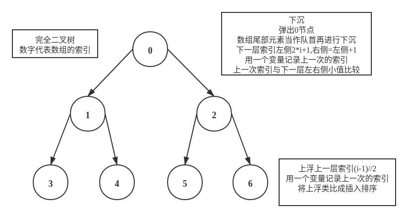

# 排序算法
## [冒泡排序](bubble_sort.py)
- $S(n)=O(1)$
- $T(n)=O(n^2)$
  1. 给定的数组按照顺序已经排好:只需要进行n-1次比较,两两交换次数为0,时间复杂度为$O(n)$
  2. 给定的数组按照逆序排列:需要进行$\frac{n*(n-1)}{2}$次比较,时间复杂度为,$O(n^2)$
  3. 给定的数组杂乱无章.在这种情况下,平均时间复杂度$O(n^2)$
- 稳定的排序算法(**两个相等的数，在排序过后，相对位置保持不变**)
```python
'''时间复杂度分情况讨论
        
@Note:
    固定顺序位arr[len(arr)-i-1],比较迭代位与后一位，如果不需要交换则表明已经排好序，将最大值填充到固定的顺序位中
'''
for i in range(len(arr)):
    finish=True
    for j in range(len(arr)-i-1):
        if arr[j]>arr[j+1]:
            arr[j],arr[j+1]=arr[j+1],arr[j]
            finish=False
    if finish:
        break
```

``` python
'''舍弃  这种方式不同情况的时间复杂度都是$O(n^2)$
        
@Note:
    固定顺序位(a[i]),比较固定位和迭代位，将最小值填充到固定的顺序位中
    有点像选择排序法(在未排序序列中找到最小元素，存放到排序序列的起始位置)
'''
for i in range(len(arr)):
    for j in range(i+1,len(arr)):
        if arr[i]>arr[j]:
            arr[i],arr[j]=arr[j],arr[i]
```

## [插入排序法](insert_sort.cpp)
- $S(n)=O(1)$
- $T(n)=O(n^2)$
  1. 给定的数组按照顺序已经排好:只需要进行n-1次比较,两两交换次数为0,时间复杂度为$O(n)$
  2. 给定的数组按照逆序排列:需要进行$\frac{n*(n-1)}{2}$次比较,时间复杂度为,$O(n^2)$
  3. 给定的数组杂乱无章.在这种情况下,平均时间复杂度$O(n^2)$
- 稳定的排序算法(两个相等的数，在排序过后，相对位置保持不变)
```c++
for (int i = 1; i < len; ++i) {
    for (int j = i - 1; j >= 0 && arr[j + 1] < arr[j]; --j) {
        std::swap(arr[j + 1], arr[j]);
    }
}
```

## [希尔排序](shell_sort.cpp)
- 简单插入排序的一种改进版本
- $S(n)=O(1)$
- n小,$T(n)=O(n^2)$
- n大,$T(n)=O(nlog(n))$

```c++
for (int gap = len / 2; gap >= 1; gap = gap / 2) {
    for (int i = gap; i < len; i = i + gap) {
        for (int j = i - gap; j >= 0 && arr[j + gap] < arr[j]; j = j - gap) {
            std::swap(arr[j + gap], arr[j]);
        }
    }
}
```

## [选择排序法](select_sort.py)
- $S(n)=O(1)$
- $T(n)=O(n^2)$
- 选择排序是一种不稳定的排序算法
  -  5，8，5，2，9 这样一组数据，使用选择排序算法来排序的话，第一次找到最小元素 2，与第一个 5 交换位置，那第一个 5 和中间的 5 顺序就变了，所以就不稳定了。正是因此，相对于冒泡排序和插入排序，选择排序就稍微逊色了。

```python
'''
        
@Note:
    在未排序序列中找到最小元素，存放到排序序列的起始位置
'''
for i in range(len(arr)):
    min_index=i
    for j in range(i+1,len(arr)):
        if arr[j]<arr[min_index]:
            min_index=j
    arr[i],arr[min_index]=arr[min_index],arr[i]
```

## [归并排序](merge_sort.cpp)
- $S(n)=O(n)$
- $T(n)=O(nlog(n))$
- 对于规模为 n 的问题,一共要进行 log(n) 次的切分,每一层的合并复杂度都是 O(n),所以整体时间复杂度为 O(nlogn)
- 合并 n 个元素需要分配一个大小为 n 的额外数组，所以空间复杂度为 O(n)
- 归并排序是稳定的排序算法
- 注意边界条件
```c++
void merge(int arr[], size_t l, size_t m, size_t r) {
    std::vector<int> left(arr + l, arr + m), right(arr + m + 1, arr + r);
    size_t i = 0, j = 0;
    for (size_t a = l; a < r; ++a) {
        if (i < left.size() && j < right.size()) { // 对不同情况进行分类
            if (left[i] <= right[j]) {
                arr[a] = left[i];
                ++i;
            } else {
                arr[a] = right[j];
                ++j;
            }
        } else if (i < left.size() && j >= right.size()) {
            arr[a] = left[i];
            ++i;
        } else if (i >= left.size() && j < right.size()) {
            arr[a] = right[j];
            ++j;
        }
    }
}

void merge_sort(int arr[], size_t l, size_t r) {
    if (l >= r) {
        return;
    }
    size_t m = (l + r) / 2;
    merge_sort(arr, l, m); // 左排序
    merge_sort(arr, m + 1, r); // 右排序
    merge(arr, l, m, r); // merge
}
```

## [快速排序](quick_sort.cpp)
- $S(n)=O(1)*O(log(n))=O(log(n))$
- $T(n)=O(nlog(n))$
- 对于规模为 n 的问题,一共要进行 log(n) 次的切分,每一层的复杂度都是 O(n),所以整体时间复杂度为 O(nlogn)
  - 但是，如果每次在选择基准值的时候，都不幸地选择了子数组里的最大或最小值。即每次把把数组分成了两个更小长度的数组，其中一个长度为 1，另一个的长度是子数组的长度减 1。这样的算法复杂度变成 O(n²)。
- 快速排序法的优化
  - 最理想的基准点是：被基准点分开的两个子数组中，数据的数量差不多。
  - 三数取中法:从区间的首、尾、中间，分别取出一个数，然后对比大小，取这 3 个数的中间值作为分区点
```c++
void quick_sort(int arr[], int l, int r) { // 左闭右闭
    if (l >= r) {
      return;
    }
    int p = arr[r];
    int i = l - 1;  //i: <p的最后1个索引, arr[i+1]: >=p的第一个元素
    for (int j = l; j < r; ++j) {
      if (arr[j] < p) {
        std::swap(arr[++i], arr[j]);
      }
    }
    std::swap(arr[i + 1], arr[r]);

    quick_sort(arr, l, i);
    quick_sort(arr, i + 2, r);
}
```

## [堆排序](heap_sort.cpp)
- 优先队列
- 
```c++
void shift_down(int arr[], size_t len, size_t i) {
    size_t idx = i, next_idx = 2 * i + 1;
    while (next_idx < len) {
        // 1. 找到子节点更小的元素, 堆顶最小
        if (next_idx + 1 < len && arr[next_idx + 1] < arr[next_idx]) {
            ++next_idx;
        }
        if (arr[idx] < arr[next_idx]) {
            break;
        }
        // 2. 下沉大的节点
        std::swap(arr[idx], arr[next_idx]);
        idx = next_idx;
        next_idx = 2 * next_idx + 1;
    }
}

void heap_sort(int arr[], size_t len) {
    // 1. build sort. 0~len/2为非叶子节点
    for (size_t i = 0; i < len; ++i) {
        shift_down(arr, len, i);
    }
    // 2. 出堆, 为了节省空间, pop堆顶放到最后
    for (size_t i = len - 1; i > 0; --i) {
        std::swap(arr[0], arr[i]);
        shift_down(arr, i, 0);
    }
}
```