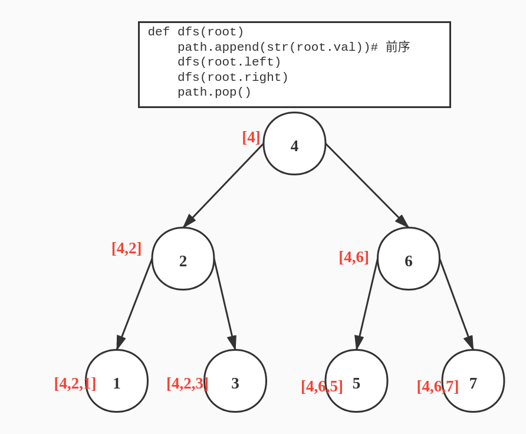
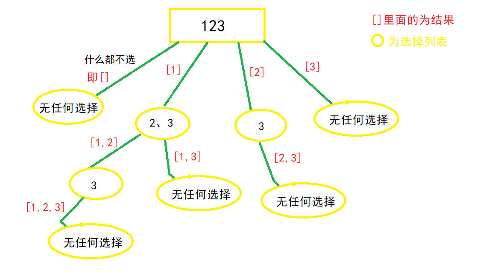

# 回溯
## 模板
```python
res = []
path = []

def backtrack(未探索区域, res, path):
    if path 满足条件:
        res.add(path) # 深度拷贝
        # return  # 如果不用继续搜索需要 return
    for 选择 in 未探索区域当前可能的选择:
        if 当前选择符合要求:
            path.add(当前选择)
            backtrack(新的未探索区域, res, path)
            path.pop()
```

## 思想、步骤
- **画递归树**!!!

## 二叉树路径记录

```python
def binaryTreePaths(self, root: TreeNode) -> List[str]:
    '''深度优先+路径记录'''
    path=[]#路径记录  全局变量，然后在dfs后pop最后一位
    ret=[]
    def dfs(root:TreeNode):
        if root is None:
            return
        path.append(str(root.val))# 前序
        if root.left is None and root.right is None:#输出  画1～3层的树
            ret.append('->'.join(path))

        dfs(root.left)
        dfs(root.right)
        path.pop()# 不pop的话path其实是前序遍历
    
    dfs(root)
    return ret
```

## [子集](78.py)
- [Link](https://leetcode-cn.com/problems/subsets/)
- 给你一个整数数组 nums ，数组中的元素 互不相同 。返回该数组所有可能的子集（幂集）。解集 不能 包含重复的子集。你可以按 任意顺序 返回解集。
- 
```python
def subsets(self, nums: List[int]) -> List[List[int]]:
    path=[]
    ret=[[]]
    
    def back_track(nums,i_start):
        for i in range(i_start,len(nums)):
            path.append(nums[i])
            ret.append(path.copy())
            back_track(nums,i+1)
            path.pop()
    
    back_track(nums,0)
    return ret
```

