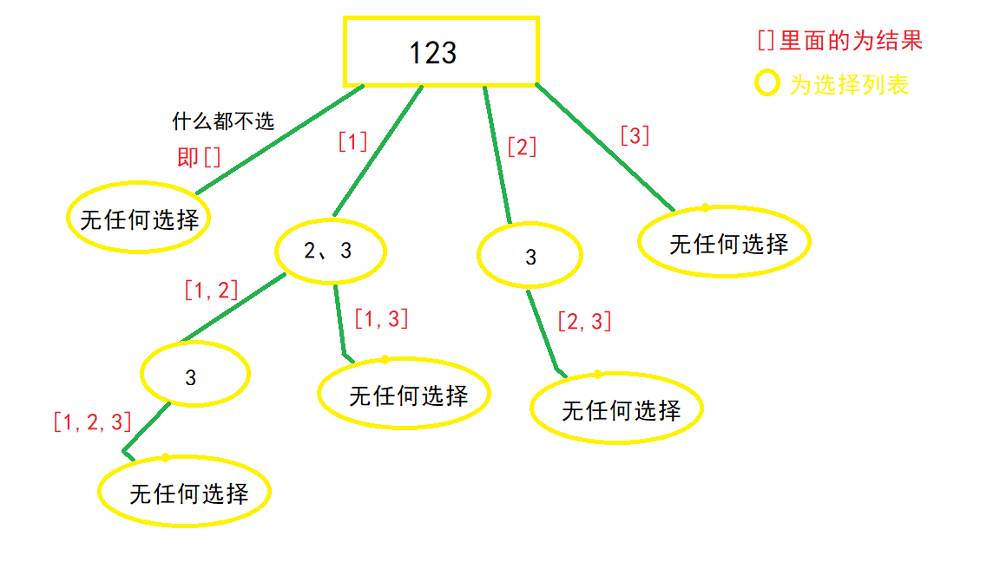

# 回溯
## 模板
```python
res = []
path = []

def backtrack(未探索区域, res, path):
    if path 满足条件:
        res.add(path) # 深度拷贝
        # return  # 如果不用继续搜索需要 return
    for 选择 in 未探索区域当前可能的选择:
        if 当前选择符合要求:
            path.add(当前选择)
            backtrack(新的未探索区域, res, path)
            path.pop()
```

## 思想、步骤
- **画递归树**!!!
- **子集，用一个 start 参数来控制选择列表！！**
- **排列遍历所有, used是否访问**

## 二叉树路径记录

```python
def binaryTreePaths(self, root: TreeNode) -> List[str]:
    '''深度优先+路径记录'''
    path=[]#路径记录  全局变量，然后在dfs后pop最后一位
    ret=[]
    def dfs(root:TreeNode):
        if root is None:
            return
        path.append(str(root.val))# 前序
        if root.left is None and root.right is None:#输出
            ret.append('->'.join(path))

        dfs(root.left)
        dfs(root.right)
        path.pop()# 不pop的话path其实是前序遍历
    
    dfs(root)
    return ret
```

## [子集](78.py)
- [Link](https://leetcode-cn.com/problems/subsets/)
- 给你一个整数数组 nums ，数组中的元素 互不相同 。返回该数组所有可能的子集（幂集）。解集 不能 包含重复的子集。你可以按 任意顺序 返回解集。
- 
- start 参数
```python
def subsets(self, nums: List[int]) -> List[List[int]]:
    path=[]
    ret=[[]]
    
    def back_track(nums,i_start):
        for i in range(i_start,len(nums)):
            path.append(nums[i])
            ret.append(path.copy())
            back_track(nums,i+1)
            path.pop()
    
    back_track(nums,0)
    return ret
```

## [子集II](90.py)
- [Link](https://leetcode-cn.com/problems/subsets-ii/)
- 给你一个整数数组 nums ，其中可能包含重复元素，请你返回该数组所有可能的子集（幂集）。解集 不能 包含重复的子集。返回的解集中，子集可以按 任意顺序 排列。
- 
- 先排序
- 再剪枝(选择哪些不进行输出)
- 
- 去除当前选择列表中，与上一个数重复的那个数，引出的分支
```python
def subsetsWithDup(self, nums: List[int]) -> List[List[int]]:
    def back_track(nums,i_start):
        for i in range(i_start,len(nums)):
            if i>i_start and nums[i]==nums[i-1]:#剪枝
                continue
                
            path.append(nums[i])
            ret.append(path.copy())
            back_track(nums,i+1)
            path.pop()
    
    nums=sorted(nums)
    ret=[[]]
    path=[]
    back_track(nums,0)
    return ret
```

## [组合总和](39.py)
- [Link](https://leetcode-cn.com/problems/combination-sum/)
- 给定一个无重复元素的正整数数组 candidates 和一个正整数 target ，找出 candidates 中所有可以使数字和为目标数 target 的唯一组合。
- 
- 子集问题变种
```python
def combinationSum(self, candidates: List[int], target: int) -> List[List[int]]:
    ret=[]
    path=[]

    def back_track(nums,i_start,sum_):#sum_变量只是为了减少计算量
        for i in range(i_start,len(nums)):
            if sum_+nums[i]>target:#剪枝
                continue

            sum_+=nums[i]
            path.append(nums[i])
            if sum_==target:#如果满足条件,则append
                ret.append(path.copy())
            
            back_track(nums,i,sum_)#可以重复利用,i
            sum_-=nums[i]#回退状态
            path.pop()
    
    back_track(candidates,0,0)
    return ret
```

## [8皇后](8.12.py)
- [Link](https://leetcode-cn.com/problems/eight-queens-lcci/)
```python
def solveNQueens(self, n: int) -> List[List[str]]:
    chessboard=[['.' for _ in range(n)] for _ in range(n)]
    ret=[]

    def valid(row,col):
        '''当前位置是否可以放'''
        # 同一列
        for i in range(row):
            if chessboard[i][col]=='Q':
                return False
        
        # 左斜边
        for i in range(row):
            if row-1-i<0 or col-1-i<0:
                break
            if chessboard[row-1-i][col-1-i]=='Q':
                return False
        
        # 右斜边
        for i in range(row):
            if row-1-i<0 or col+1+i==n:
                break
            if chessboard[row-1-i][col+1+i]=='Q':
                return False
        return True

    def back_track(row):
        if row==n:#遍历完所有行之后
            out=[''.join(c) for c in chessboard]
            ret.append(out)
            return
        for i in range(n):
            if valid(row,i):
                chessboard[row][i]='Q'
                back_track(row+1)
                chessboard[row][i]='.'
    back_track(0)
    return ret
```

## [字符串的排列](38.py)
- [Link](https://leetcode-cn.com/problems/zi-fu-chuan-de-pai-lie-lcof/)
- 输入一个字符串，打印出该字符串中字符的所有排列。
- 
- 排序
- used数组来记录使用过的数字, 没有i_start
- 去重剪枝:未使用的数字与前一个未使用的相等!
```python
def permutation(self, s: str) -> List[str]:
    ret=[]
    path=[]
    used=[False for i in range(len(s))]

    s=sorted(s)#排序!!!

    def back_track():
        if len(path)==len(s):
            ret.append(''.join(path))
            return
        for i in range(len(s)):
            if used[i]:
                continue
            
            if i>0 and s[i]==s[i-1] and not used[i-1]:#剪枝
                continue
            used[i]=True
            path.append(s[i])
            back_track()
            used[i]=False
            path.pop()
    back_track()
    return ret
```

## [解数独](37.py)
```python
def solveSudoku(self, board: List[List[str]]) -> None:
    """
    Do not return anything, modify board in-place instead.
    """
    def valid(row,col,c):
        # 行判断
        for i in range(9):
            if board[row][i]==c:
                return False
        
        # 列判断
        for i in range(9):
            if board[i][col]==c:
                return False
        
        # 9格
        s_i,s_j=row//3*3,col//3*3
        for i in range(s_i,s_i+3):
            for j in range(s_j,s_j+3):
                if board[i][j]==c:
                    return False
        
        return True
    
    def back_track():
        for i in range(len(board)):
            for j in range(len(board[0])):
                if board[i][j]!='.':#存在数字
                    continue
                for c in ['1','2','3','4','5','6','7','8','9']:#(i, j) 这个位置放c是否合适
                    if not valid(i,j,c):#剪枝
                        continue
                    board[i][j]=c# 放置c
                    if back_track(): return True
                    board[i][j]='.'
                return False
        return True
    
    back_track()
```

## [岛屿数量](200.cpp)
- [Link](https://leetcode.cn/problems/number-of-islands/description/)
- 给你一个由 '1'（陆地）和 '0'（水）组成的的二维网格，请你计算网格中岛屿的数量。岛屿总是被水包围，并且每座岛屿只能由水平方向和/或竖直方向上相邻的陆地连接形成。此外，你可以假设该网格的四条边均被水包围。
- 不是回溯, 是dfs, bfs

```cpp
void dfs(std::vector<std::vector<char>>& grid, i, j) {
    int nr = grid.size();
    int nc = grid[0].size();

    grid[i][j] = "0";

    if (i - 1 >= 0 && grid[i - 1][j] == "1") {
        dfs(grid, i - 1, j);
    }
    if (i + 1 < nr && grid[i + 1][j] == "1") {
        dfs(grid, i + 1, j);
    }
    if (j - 1 >= 0 && grid[i][j - 1] == "1") {
        dfs(grid, i, j - 1);
    }
    if (j + 1 < nc && grid[i][j + 1] == "1") {
        dfs(grid, i, j + 1);
    }
}

int numIslands(std::vector<std::vector<char>>& grid) {
    int nr = grid.size();
    int nc = grid[0].size();
    int num_lands = 0;
    for (int i = 0; i < nr; ++i) {
        for (int j = 0; j < nc; ++j) {
            if (grid[i][j] == "1") {
                ++num_lands;
                dfs(grid, i, j);
            }
        }
    }
    return num_lands;
}
```

```cpp
void bfs(std::vector<std::vector<char>>& grid, i, j) {
    std::queue<std::pair<int, int>> q;
    q.emplace({i, j});
    while (!q.empty()) {
        auto ij = q.front();
        q.pop();
        int i = ij.first, j = ij.second;
        if (i - 1 >= 0 && grid[i - 1][j] == "1") {
            q.emplace({i - 1, j});
            grid[i - 1][j] == "0";
        }
        if (i + 1 < nr && grid[i + 1][j] == "1") {
            q.emplace({i + 1, j});
            grid[i + 1][j] == "0";
        }
        if (j - 1 >= 0 && grid[i][j - 1] == "1") {
            q.emplace({i, j - 1});
            grid[i][j - 1] == "0";
        }
        if (j + 1 < nc && grid[i][j + 1] == "1") {
            q.emplace({i, j + 1});
            grid[i][j + 1] == "0";
        }
    }
}

int numIslands(std::vector<std::vector<char>>& grid) {
    int nr = grid.size();
    int nc = grid[0].size();
    int num_lands = 0;
    for (int i = 0; i < nr; ++i) {
        for (int j = 0; j < nc; ++j) {
            if (grid[i][j] == "1") {
                ++num_lands;
                bfs(grid, i, j);
            }
        }
    }
    return num_lands;
}
```