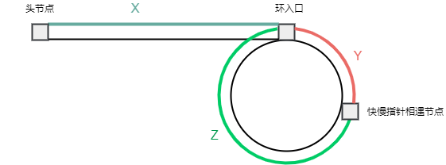

# 链表
> 改变节点位置, 需要定义对应的last节点, last->next要发生改变
> 找中间节点, 要注意slow, fast节点的初值. fast=node->next. 如果fast=node, 递归场景, 回文链表会出问题.

## [两数相加](2.py)
- [Link](https://leetcode-cn.com/problems/add-two-numbers/)
- 给你两个 非空 的链表，表示两个非负的整数。它们每位数字都是按照 逆序 的方式存储的，并且每个节点只能存储 一位 数字。
- 请你将两个数相加，并以相同形式返回一个表示和的链表。
- 你可以假设除了数字 0 之外，这两个数都不会以 0 开头。
```c++
ListNode* ret = new ListNode();
int next_add = 0; // 进位
ListNode* last = ret; // 上个节点
while (!(l1 == nullptr && l2 == nullptr && next_add == 0)) { // 在l1 l2 都为nullptr并且进位为0时退出
  int sum = ((l1 != nullptr) ? l1->val : 0) + ((l2 != nullptr) ? l2->val : 0) + next_add;
  last->next = new ListNode(sum % 10);
  next_add = static_cast<int>(sum / 10);

  last = last->next; // 挪位
  l1 = (l1 != nullptr) ? l1->next : l1; // 挪位
  l2 = (l2 != nullptr) ? l2->next : l2; // 挪位
}
return ret->next;
```

## [两数相加II](445.py)
- [Link](https://leetcode-cn.com/problems/add-two-numbers-ii/)
- 给你两个 非空 链表来代表两个非负整数。数字最高位位于链表开始位置。它们的每个节点只存储一位数字。将这两数相加会返回一个新的链表。
- 你可以假设除了数字 0 之外，这两个数字都不会以零开头。
```python
def addTwoNumbers(self, l1: ListNode, l2: ListNode) -> ListNode:
    '''两数之和II,高位指向低位'''
    reverse_l1=[]#stack
    while l1 is not None:
        reverse_l1.append(l1.val)
        l1=l1.next
    
    reverse_l2=[]#stack
    while l2 is not None:
        reverse_l2.append(l2.val)
        l2=l2.next

    last=None
    add=0
    while len(reverse_l1)!=0 or len(reverse_l2)!=0 or add!=0:
        sum=(0 if len(reverse_l1)==0 else reverse_l1.pop()) + \
            (0 if len(reverse_l2)==0 else reverse_l2.pop()) + add# stack进行顺序翻转

        add,sum=divmod(sum,10)

        ret=ListNode(sum,last)
        last=ret
    return ret
```

## [从尾到头打印链表](6.py)
- [Link](https://leetcode-cn.com/problems/cong-wei-dao-tou-da-yin-lian-biao-lcof/)
- 输入一个链表的头节点，从尾到头反过来返回每个节点的值（用数组返回）
```python
def reversePrint(self, head: ListNode) -> List[int]:
    '''从尾到头打印链表'''
    ret=[]
    while head is not None:
        ret.append(head.val)
        head=head.next
    return ret[::-1]
```

## [删除链表中的节点](237.py)
- [Link](https://leetcode-cn.com/problems/delete-node-in-a-linked-list/)
- 请编写一个函数，使其可以删除某个链表中给定的（非末尾）节点。传入函数的唯一参数为 要被删除的节点 。
```python
def deleteNode(self, node):
    """删除传入的node节点"""
    node.val=node.next.val
    node.next=node.next.next
```

## [删除排序链表中的重复值](83.py)
- [Link](https://leetcode-cn.com/problems/remove-duplicates-from-sorted-list/)
- 存在一个按升序排列的链表，给你这个链表的头节点 head ，请你删除所有重复的元素，使每个元素 只出现一次 。
- 返回同样按升序排列的结果链表。
```c++
ListNode *ret = node;
while (node != nullptr) { // 遍历
  while (node->next != nullptr && node->val == node->next->val) { // 去重
    node->next = node->next->next;
  }
  node = node->next;
}
return ret;
```

## [删除排序链表中的重复元素 II](82.py)
- [Link](https://leetcode-cn.com/problems/remove-duplicates-from-sorted-list-ii/)
- 存在一个按升序排列的链表，给你这个链表的头节点 head ，请你删除链表中所有存在数字重复情况的节点，只保留原始链表中 **没有重复出现** 的数字。
- 返回同样按升序排列的结果链表。
```c++
ListNode *last = new ListNode(0, node); // last节点
ListNode *ret = last;
while (node != nullptr) { // 遍历
  bool is_duplicates = false;
  while (node->next != nullptr && node->val == node->next->val) { //删除重复节点
    node->next = node->next->next;
    is_duplicates = true;
  }
  if (is_duplicates) { // 当前节点之前存在重复节点
    node = node->next;
    last->next = node;
  } else {
    last = node;
    node = node->next;
  }
}
return ret->next;
```

## [移除链表元素](203.py)
- [Link](https://leetcode-cn.com/problems/remove-linked-list-elements/)
- 给你一个链表的头节点 head 和一个整数 val ，请你删除链表中所有满足 Node.val == val 的节点，并返回 新的头节点 。
```c++
ListNode* last = new ListNode(0, node);
ListNode* ret = last;
while (node != nullptr) {
  if (node->val == val) {
    node = node->next;
    last->next = node;
  } else {
    last = node;
    node = node->next;
  }
}
return ret->next;
```

## [返回倒数第 k 个节点](2_2.py)
- [Link](https://leetcode-cn.com/problems/kth-node-from-end-of-list-lcci/)
- 实现一种算法，找出单向链表中倒数第 k 个节点。返回该节点的值。
```python
def kthToLast(self, head: ListNode, k: int) -> int:
    '''返回倒数第 k 个节点
    
    @Note:
        p,q都指向head,p先走k步,然后pq都往前走,直到p为None
        快慢指针
    '''
    p,q=head,head
    for i in range(k):
        p=p.next
    while p is not None:
        p=p.next
        q=q.next
    return q.val
```

## [两两交换链表中的节点](24.py)
- [Link](https://leetcode-cn.com/problems/swap-nodes-in-pairs/)
- 给定一个链表，两两交换其中相邻的节点，并返回交换后的链表。你不能只是单纯的改变节点内部的值，而是需要实际的进行节点交换。
```c++
ListNode *ret = new ListNode(0, node);
ListNode *last = ret;
while (node != nullptr) {
  ListNode *next = node->next;
  if (next != nullptr) {
    node->next = next->next;
    next->next = node;
    last->next = next;

    last = node;  // 挪位
    node = node->next; // 挪位
  } else {
    break;
  }
}
return ret->next;
```

## [合并两个有序链表](21.py)
- [Link](https://leetcode-cn.com/problems/merge-two-sorted-lists/)
- 将两个升序链表合并为一个新的 升序 链表并返回。新链表是通过拼接给定的两个链表的所有节点组成的。 
```python
def mergeTwoLists(self, l1: ListNode, l2: ListNode) -> ListNode:
    '''合并两个有序链表'''
    ret=ListNode()
    last=ret
    while l1 is not None and l2 is not None:
        if l1.val<=l2.val:
            last.next=l1
            l1=l1.next#挪位
        else:
            last.next=l2
            l2=l2.next#挪位
        last=last.next
    last.next=l1 if l1 is not None else l2#剩余长度
    return ret.next
```

## [合并K个升序链表](23.py)
- [Link](https://leetcode-cn.com/problems/merge-k-sorted-lists/)
- 给你一个链表数组，每个链表都已经按升序排列。请你将所有链表合并到一个升序链表中，返回合并后的链表
- 思路:合并前后两个链表，结果放在后一个链表位置上，依次循环下去。$O(k^2n)$
  - $k$:lists长度
  - $n$:lists元素的平均长度
- 思路:归并排序变种  $O(klog(k)n)$
```python
def merge2Lists(self,l1:ListNode,l2:ListNode) -> ListNode:
    ret=ListNode()
    last=ret
    while l1 and l2:
        if l1.val<=l2.val:
            last.next=l1
            l1=l1.next
        else:
            last.next=l2
            l2=l2.next
        last=last.next
    last.next=l1 if l1 is not None else l2
    return ret.next

def mergeKLists_all(self, lists: List[ListNode]) -> ListNode:
    '''合并K个有序链表'''
    if len(lists)==0 or lists is None:
        return None
    for i in range(1,len(lists)):
        lists[i]=self.merge2Lists(lists[i-1],lists[i])
    return lists[len(lists)-1]

def mergeKLists(self, lists: List[ListNode]) -> ListNode:
    '''合并K个有序链表
    
    @Note:
        归并排序
    '''
    if len(lists)==0 or lists is None:
        return None
    return self.mergeKLists_sort(lists,0,len(lists)-1)

def mergeKLists_sort(self,lists: List[ListNode],l,r) -> ListNode:
    if l==r:
        return lists[l]#注意返回值,merge2Lists会更改原链表
    m=(l+r)//2
    l1=self.mergeKLists_sort(lists,l,m)
    l2=self.mergeKLists_sort(lists,m+1,r)
    return self.merge2Lists(l1,l2)
```

## [插入排序](147.py)
- [Link](https://leetcode-cn.com/problems/insertion-sort-list/)
- 对链表进行插入排序。
- **链表题记得画图**
```c++
ListNode *ret = new ListNode(0, node);
ListNode *last = node; // 修改链表顺序需要last
ListNode *cur = node->next;

while (cur != nullptr) {
  if (last->val <= cur->val) {
    cur = cur->next;
    last = last->next;
  } else {
    ListNode *find = ret->next;
    ListNode *last_find = ret;  // 修改链表顺序需要last
    while (find->val <= cur->val) {
      last_find = find;
      find = find->next;
    }

    last->next = cur->next;
    cur->next = find;
    last_find->next = cur;
    
    cur = last->next;
  }
}
return ret->next;
```

## [排序链表](148.py)
- [Link](https://leetcode-cn.com/problems/sort-list/)
- 给你链表的头结点 head ，请将其按 升序 排列并返回 排序后的链表 。
- 归并排序(特别注意**快慢指针求中间位置**)
```c++
ListNode* merge_2_list(ListNode* l1, ListNode * l2) {
  ListNode *ret = new ListNode();
  ListNode *last = ret;
  while (l1 && l2) {
    if (l1->val <= l2->val) {
      last->next = l1;
      l1 = l1->next;
    } else {
      last->next = l2;
      l2 = l2->next;
    }
    last = last->next;
  }

  last->next = l1 ? l1 : l2;
  return ret->next;
}

ListNode* merge_sort_list(ListNode* node) {
  if (!(node && node->next)) { // nullptr或单个节点 return
    return node;
  }

  // 找中间位置
  ListNode *slow = node;
  ListNode *fast = node->next; //很关键. 如果是node, 那么两个节点时, 当前轮次跟下一轮次参数一样, 不会return
  while (fast && fast->next) {
    slow = slow->next;
    fast = fast->next->next;
  }
  ListNode *second = slow->next;
  slow->next = nullptr; //关键

  ListNode* l1 = merge_sort_list(node);
  ListNode* l2 = merge_sort_list(second);
  return merge_2_list(l1, l2);
}
```

## [反转链表](206.py)
- [Link](https://leetcode-cn.com/problems/reverse-linked-list/)
- 给你单链表的头节点 head ，请你反转链表，并返回反转后的链表。
- 画图!!!
```python
def reverseList(self, head: ListNode) -> ListNode:
    '''反转链表'''
    ret=None#虚节点
    while head:
        tmp=head.next
        head.next=ret
        ret=head
        head=tmp
    return ret#返回自身
```

## [反转链表II](92.py)
- [Link](https://leetcode-cn.com/problems/reverse-linked-list-ii/)
- 给你单链表的头指针 head 和两个整数 left 和 right ，其中 left <= right 。请你反转从位置 left 到位置 right 的链表节点，返回 反转后的链表 。
```c++
ListNode* reverse_list(ListNode* node) {
  ListNode* last = nullptr;
  ListNode* next = nullptr;
  while (node != nullptr) {
    next = node->next;
    node->next = last;

    last = node;
    node = next;
  }
  return last;
}

ListNode* reverse_list(ListNode* node, int start, int end) {
  int index = 0;
  ListNode *ret = new ListNode(0, node);
  ListNode *last = ret, *last_start = nullptr;
  ListNode *start_node = nullptr, *end_next_node = nullptr;
  while (node != nullptr) {
    ++index;
    if (index == start) {
      last_start = last;
      start_node = node;
    } else if (index == end) {
      end_next_node = node->next;
      node->next = nullptr; // 关键
      break;
    }

    last = node;
    node = node->next;
  }
  
  ListNode* reverse = reverse_list(start_node);
  last_start->next = reverse;
  start_node->next = end_next_node;

  return ret->next;
}
```

## [重排链表](143.py)
- [Link](https://leetcode-cn.com/problems/reorder-list/)
- 给定一个单链表 L 的头节点 head ，单链表 L 表示为：
- L0 → L1 → … → Ln-1 → Ln 
- 请将其重新排列后变为：
- L0 → Ln → L1 → Ln-1 → L2 → Ln-2 → …
- 不能只是单纯的改变节点内部的值，而是需要实际的进行节点交换。
- 思路:快慢指针分两半;反转右半部分;左右两链表依次相连
```c++
ListNode* reverse_list(ListNode* node) {
  ListNode* last = nullptr;
  ListNode* next = nullptr;
  while (node != nullptr) {
    next = node->next;
    node->next = last;

    last = node;
    node = next;
  }
  return last;
}

ListNode* reorder_list(ListNode* node) {
  ListNode *ret = node;
  // 快慢指针求中值
  ListNode *slow = node, *fast = node;
  while (fast && fast->next) {
    fast = fast->next->next;
    slow = slow->next;
  }
  ListNode *right = slow->next;
  slow->next = nullptr;
  // 右半边reverse
  ListNode* second = reverse_list(right);
  // 拼接
  while (node && second) {
    ListNode *node_next = node->next;
    ListNode *second_next = second->next;

    node->next = second;
    second->next = node_next;

    node = node_next;
    second = second_next;
  }

  return ret;
}
```

## [旋转链表](61.py)
- [Link](https://leetcode-cn.com/problems/rotate-list/)
- 给你一个链表的头节点 head ，旋转链表，将链表每个节点向右移动 k 个位置。
- 将链表右半部分的 k 的节点拼接到 head 即可。
- 注：k 对链表长度 n 取余，即 k %= n。
```python
def rotateRight(self, head: ListNode, k: int) -> ListNode:
    cur=head#取余
    n=0
    while cur:
        cur=cur.next
        n+=1
    if n==1 or n==0:
        return head#特判
    k=k%n
    if k==0:
        return head#特判

    # 快位置
    ret=ListNode(0,head)
    last_fast=ret
    fast=head
    while k!=0:
        k-=1
        fast=fast.next
        last_fast=last_fast.next
    
    # 快慢位置同时跑
    last_find=ret
    find=head
    while fast:
        last_fast=last_fast.next
        fast=fast.next

        find=find.next
        last_find=last_find.next
    # 拼接
    last_fast.next=head
    last_find.next=None
    head=find
    return head
```

## [回文链表](234.py)
- [Link](https://leetcode-cn.com/problems/palindrome-linked-list/)
- 请判断一个链表是否为回文链表。
```python
def reverse(self,head:ListNode)->ListNode:
    ret=None
    while head:
        tmp=head.next
        head.next=ret
        ret=head
        head=tmp
    return ret

def isPalindrome(self, head: ListNode) -> bool:
    '''快慢指针求中间,反转右半,进行顺序判断'''
    slow,fast=head,head.next
    while fast and fast.next:
        slow=slow.next
        fast=fast.next.next
    m=slow.next
    slow.next=None

    m=self.reverse(m)
    while head and m:
        if head.val!=m.val:
            return False
        head=head.next
        m=m.next
    return True
```

## [相交链表](160.py)
- [Link](https://leetcode-cn.com/problems/intersection-of-two-linked-lists/)
- 给你两个单链表的头节点 headA 和 headB ，请你找出并返回两个单链表相交的起始节点。如果两个链表没有交点，返回 null 。
- 方式一、遍历第一个得到map、set, 再遍历第二个判断是否在第一个存在
- 方式二、环会相交, 定义两个指针形成环
```python
def getIntersectionNode(self, headA: ListNode, headB: ListNode) -> ListNode:
    '''判断链表是否相交
    
    @Note:
        a1->a2->...None->b1->b2->...None
        b1->b2->...None->a1->a2->...None
        这样的总长一样,且末尾都为None.注意要有None!!
    '''
    cur_A=headA
    cur_B=headB
    while cur_A or cur_B:
        if cur_A==cur_B:
            return cur_B
        cur_A=cur_A.next if cur_A else headB
        cur_B=cur_B.next if cur_B else headA
    return None
```

## [奇偶链表](328.py)
- [Link](https://leetcode-cn.com/problems/odd-even-linked-list/)
- 给定一个单链表，把所有的奇数节点和偶数节点分别排在一起。请注意，这里的奇数节点和偶数节点指的是节点编号的奇偶性，而不是节点的值的奇偶性。
- 请尝试使用原地算法完成。你的算法的空间复杂度应为 O(1)，时间复杂度应为 O(nodes)，nodes 为节点总数。
```python
def oddEvenList(self, head: ListNode) -> ListNode:
    '''奇偶链表
    
    @Note:
        画图
    '''
    if head is None or head.next is None:
        return head
    odd=head
    even=head.next
    start_even=even
    last_odd=None
    while odd and even:
        odd.next=even.next
        last_odd=odd
        odd=odd.next

        even.next=odd.next if odd else None#注意
        even=even.next
    if last_odd.next:#奇数个
        last_odd=last_odd.next
    last_odd.next=start_even#!!!注意
    return head
```

## [环形链表](141.py)
- [Link](https://leetcode-cn.com/problems/linked-list-cycle/)
- 给定一个链表，判断链表中是否有环。
- 方式一、遍历得到map、set, 判断之后的元素是否在之前出现过
- 方式二、环会相交, 定义快慢指针(这里不是找中间节点, 不用fast=fast->next)
```python
def hasCycle(self, head: ListNode) -> bool:
    '''快慢指针'''
    slow,fast=head,head#注意这里和查找中间位置的初始值不同  查找中间位置的fast=head.next
    while fast and fast.next:
        slow=slow.next
        fast=fast.next.next
        if slow==fast:
            return True
    return False
```

## [环形链表 II](142.py)
- [Link](https://leetcode-cn.com/problems/linked-list-cycle-ii/)
- 给定一个链表，返回链表开始**入环的第一个节点**。 如果链表无环，则返回 null。
- 思路:
  - 先利用快慢指针判断链表是否有环，没有环则直接返回 null。
  - 若链表有环，我们分析快慢相遇时走过的距离。
  - 对于慢指针（每次走 1 步），走过的距离为 S=X+Y ①；
  - 快指针（每次走 2 步）走过的距离为 2S=X+Y+N(Y+Z) ②。如下图所示，其中 N 表示快指针与慢指针相遇时在环中所走过的圈数，而我们要求的环入口，也即是 X 的距离：
  - 
  - 根据式子 ①②，得出 X+Y=N(Y+Z) => X=(N-1)(Y+Z)+Z。
  - 定义一个p指向head,p与slow同时慢走,当相遇时即为环的入口
```python
def detectCycle(self, head: ListNode) -> ListNode:
    slow,fast=head,head
    cycle=False
    while fast and fast.next:
        slow=slow.next
        fast=fast.next.next

        if slow==fast:
            cycle=True
            break
    
    if not cycle:
        return None
    
    p=head
    while p!=slow:
        p=p.next
        slow=slow.next
    return slow
```