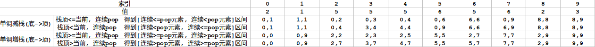

# 栈和队列
## [有效的括号](20.py)
- [Link](https://leetcode-cn.com/problems/valid-parentheses/)
- 给定一个只包括 '('，')'，'{'，'}'，'['，']' 的字符串 s ，判断字符串是否有效。
- 用栈存左括号,当出现右括号时弹出(如果此时为空则False),最后栈不为空为False
```python
def isValid(self, s: str) -> bool:
    stack=[]
    for this_s in s:
        if this_s=='[':
            stack.append(this_s)
        elif this_s=='{':
            stack.append(this_s)
        elif this_s=='(':
            stack.append(this_s)
        else:
            if len(stack)==0:#注意
                return False
            pop=stack.pop()
            if this_s==']' and pop!='[':
                return False
            if this_s=='}' and pop!='{':
                return False
            if this_s==')' and pop!='(':
                return False
    if len(stack)!=0:#注意
        return False
    return True
```

## [最小栈](155.py)
- [Link](https://leetcode-cn.com/problems/min-stack/)
- 设计一个支持 push ，pop ，top 操作，并能在常数时间内检索到最小元素的栈。
  - push(x) —— 将元素 x 推入栈中。
  - pop() —— 删除栈顶的元素。
  - top() —— 获取栈顶元素。
  - getMin() —— 检索栈中的最小元素。
- 用一个辅助栈，辅助栈栈顶存栈当前的最小值，当栈pop时，辅助栈也pop;当栈append的时候,辅助栈append当前最小值

| min       | 6   | 6   | 4   | 3   |
| --------- | --- | --- | --- | --- |
| stack     | 6   | 7   | 4   | 3   |
| min_stack | 6   | 6   | 4   | 3   |

## [最大队列](59.py)
- [Link](https://leetcode-cn.com/problems/dui-lie-de-zui-da-zhi-lcof/)
- 请定义一个队列并实现函数 max_value 得到队列里的最大值，要求函数max_value、push_back 和 pop_front 的均摊时间复杂度都是O(1)。
- 若队列为空，pop_front 和 max_value 需要返回 -1

| max   | 7   | 7   | 4   | 3   |
| ----- | --- | --- | --- | --- |
| queue | 6   | 7   | 4   | 3   |


- 添加一个辅助队列  [7,4,3]
- 当插入时,如果插入元素>=辅助队首元素,那么将辅助队首移除,直到队首为插入元素
- 当出队时,如果出队元素<辅助队首,只出队,如果出队元素=辅助队首元素,出队并出辅助队

## [用栈实现队列](232.py)
- [Link](https://leetcode-cn.com/problems/implement-queue-using-stacks/)
- 请你仅使用两个栈实现先入先出队列。队列应当支持一般队列支持的所有操作（push、pop、peek、empty）
1. push:往stack1中添加元素
2. **move:当stack2为空时,将stack1的所有元素移到stack2中**
3. pop:**调用move**,stack2进行pop
4. peek:**调用move**,stack2最后一位

## [用队列实现栈](225.py)
- [Link](https://leetcode-cn.com/problems/implement-stack-using-queues/)
- 请你仅使用两个队列实现一个后入先出（LIFO）的栈，并支持普通栈的全部四种操作（push、top、pop 和 empty）
1. 使用一个队列即可
2. push:正常push,然后将之前的元素都pop再push,相当于将push之前的元素都挪到后面
   ```python
    def push(self, x: int) -> None:
        self.q.append(x)
        n = len(self.q)
        for i in range(1, n):
            self.q.append(self.q.pop(0))
   ```
3. pop、peek:与正常的一致

## [逆波兰表达式](150.py)
- [Link](https://leetcode-cn.com/problems/evaluate-reverse-polish-notation/)
- 根据 逆波兰表示法，求表达式的值
- 遍历数组，遇到数字则压入栈中，遇到运算符号，则从栈中弹出右、左操作数，运算过后，将结果压入栈中。遍历结束后，返回栈中的唯一元素。

## [最近的请求次数](933.py)
- [Link](https://leetcode-cn.com/problems/number-of-recent-calls/)
- int ping(int t) 在时间 t 添加一个新请求，其中 t 表示以毫秒为单位的某个时间，并返回过去 3000 毫秒内发生的所有请求数（包括新请求）。确切地说，返回在 [t-3000, t] 内发生的请求数。
```python
def ping(self, t: int) -> int:
    self.q.append(t)
    while self.q[0] < t - 3000:
        self.q.popleft()
    return len(self.q)
```

## !!!单调栈!!!
- **使单调增栈**,(保证栈中元素为递增的),当当前元素<栈顶时,一直弹出元素.弹出元素时可以得到
  1. 连续>=弹出元素的右边界(当前元素索引-1,遍历完,栈不为空则是len-1)
  2. 连续>弹出元素的左边界(弹出元素后的栈顶元素索引+1,没有栈顶则是0)
  3. 在1向右第一个<的右边界
  4. 在2向左第一个<=的左边界


- **使单调减栈**,(保证栈内元素为递减的),当当前元素>栈顶时,一直弹出元素.弹出元素时可以得到
  1. 连续<=弹出元素的右边界(当前元素索引-1,遍历完,栈不为空则是len-1)
  2. 连续<弹出元素的左边界(弹出元素后的栈顶元素索引+1,没有栈顶则是0)
  3. 在1向右第一个>的右边界
  4. 在2向左第一个>=的左边界

```python
def single_stack(self, height: List[int]) -> int:
    s=[]
    for i,h in enumerate(height):
        while s and h<=height[s[-1]]:# <=可以换符号: <、>、>=
            pop_idx=s.pop()
            r=i-1
            l=s[-1]+1 if len(s)!=0 else 0
            print(pop_idx,height[pop_idx],l,r)
        s.append(i)
    while s:
        pop_idx=s.pop()
        r=len(height)-1
        l=s[-1]+1 if len(s)!=0 else 0
        print(pop_idx,height[pop_idx],l,r)
```


## [每日温度](739.py)
- [Link](https://leetcode-cn.com/problems/daily-temperatures/)
- 请根据每日 气温 列表 temperatures ，请计算在每一天需要等几天才会有更高的温度。如果气温在这之后都不会升高，请在该位置用 0 来代替。
- 单调减栈!!!
```python
def dailyTemperatures(self, temperatures: List[int]) -> List[int]:
    '''栈递减,类似滑动窗口,满足条件弹出,不然往里加'''
    ret=[0 for _ in range(len(temperatures))]
    s=[]
    for j in range(len(temperatures)):
        while s and temperatures[j]>temperatures[s[-1]]:#满足条件弹出,直到不满足
            i=s.pop()
            ret[i]=j-i
        s.append(j)
    return ret
```

## [柱状图中最大的矩形](84.py)
- [Link](https://leetcode-cn.com/problems/largest-rectangle-in-histogram/)
- 给定 n 个非负整数，用来表示柱状图中各个柱子的高度。每个柱子彼此相邻，且宽度为 1 。求在该柱状图中，能够勾勒出来的矩形的最大面积。
- 单调增栈!!!
```python
def largestRectangleArea(self, heights: List[int]) -> int:
    s=[]#存索引
    max_area=0
    for i in range(len(heights)):
        while s and heights[s[-1]]>heights[i]:#满足条件则弹出,直到不满足条件
            cur=s.pop()
            l=s[-1]+1 if len(s)!=0 else 0
            max_area=max(max_area,heights[cur]*(i-1-l+1))
        s.append(i)
    while s:#当栈里仍然存在数据时
        cur=s.pop()
        l=s[-1]+1 if len(s)!=0 else 0
        max_area=max(max_area,heights[cur]*(len(heights)-1-l+1))
    return max_area

def largestRectangleArea_all(self, heights: List[int]) -> int:
    max_area=0
    for i in range(len(heights)):
        l,r=i,i
        while r<len(heights) and heights[r]>=heights[i]:
            r+=1
        while l>=0 and heights[l]>=heights[i]:
            l-=1
        max_area=max(max_area,heights[i]*(r-l-1))
    return max_area
```

## [基本计算器 II](227.py)
- [Link](https://leetcode-cn.com/problems/basic-calculator-ii/)
- 给你一个字符串表达式 s ，请你实现一个基本计算器来计算并返回它的值。整数除法仅保留整数部分。s 由整数和算符 ('+', '-', '*', '/') 组成，中间由一些空格隔开
- 遍历字符串 s，并用变量 preSign 记录每个数字之前的运算符，对于第一个数字，其之前的运算符视为加号。每次遍历到数字末尾时，根据 preSign 来决定计算方式：
  1. 加号：将数字压入栈；
  2. 减号：将数字的相反数压入栈；
  3. 乘除号：计算数字与栈顶元素，并将栈顶元素替换为计算结果。
- 注意最后一个数字也要进行运算,注意空格忽略不是最后一位的空
- 注意不能用//,//为向下取整,如果前面为负数-3//2=-2
```python
def calculate(self, s: str) -> int:
    pre_sign='+'
    stack=[]
    num=0
    for i,this_c in enumerate(s):
        if this_c.isdigit():
            num=10*num+int(this_c)
        if (not this_c.isdigit() and this_c!=' ') or i==len(s)-1:#注意最后一个数字也要进行运算,注意空格忽略不是最后一位的空格             
            if pre_sign=='+':
                stack.append(num)
            elif pre_sign=='-':
                stack.append(-num)
            elif pre_sign=='*':
                stack.append(stack.pop()*num)
            elif pre_sign=='/':
                stack.append(int(stack.pop()/num))#注意不能用//,//为向下取整,如果前面为负数-3//2=-2
            
            pre_sign=this_c
            num=0
    ret=0#对栈内剩余结果计算结果
    while stack:
        ret+=stack.pop()
    return ret
```

## [下一个更大元素 I](469.py)
- [Link](https://leetcode-cn.com/problems/next-greater-element-i/)
- 给你两个 没有重复元素 的数组 nums1 和 nums2 ，其中nums1 是 nums2 的子集。
- 请你找出 nums1 中每个元素在 nums2 中的下一个比其大的值。
- nums1 中数字 x 的下一个更大元素是指 x 在 nums2 中对应位置的右边的第一个比 x 大的元素。如果不存在，对应位置输出 -1 。
- 单调减栈
```python
def nextGreaterElement(self, nums1: List[int], nums2: List[int]) -> List[int]:
    '''单调减栈<     左<   右<='''
    s=[]
    dic={}
    for i,num in enumerate(nums2):
        while s and s[-1]<num:
            dic[s.pop()]=num
        s.append(num)
    ret=[-1 for _ in range(len(nums1))]
    for i,num in enumerate(nums1):
        if num in dic:
            ret[i]=dic[num]
    return ret
```

## [下一个更大元素 II](503.py)
- [Link](https://leetcode-cn.com/problems/next-greater-element-ii/)
- 给定一个循环数组（最后一个元素的下一个元素是数组的第一个元素），输出每个元素的下一个更大元素。数字 x 的下一个更大的元素是按数组遍历顺序，这个数字之后的第一个比它更大的数，这意味着你应该循环地搜索它的下一个更大的数。如果不存在，则输出 -1。
- 单调栈+循环数组(自身+自身,后面的用i%len索引)
```python
def nextGreaterElements(self, nums: List[int]) -> List[int]:
    s=[]
    ret=[-1]*len(nums)
    for i in range(2*len(nums)):#自身+自身  循环数组
        real_i=i%len(nums)# 用i%len索引
        while s and nums[s[-1]]<nums[real_i]:
            pop_i=s.pop()
            ret[pop_i]=nums[real_i]
        s.append(real_i)
    return ret
```