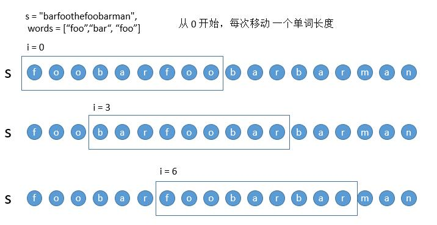
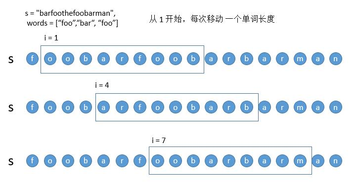

# 字符串
## [无重复字符的最长子串](3.py)
- [Link](https://leetcode-cn.com/problems/longest-substring-without-repeating-characters/)
- 给定一个字符串 s ，请你找出其中不含有重复字符的 最长子串 的长度
- **滑动窗口法**!!!  (类似快慢指针, 只是慢指针会连续前移)
```c++
// 进入这个队列（窗口）为 abc 满足题目要求，当再进入a，队列变成abca，这时候不满足要求.将最左侧的元素移除
std::unordered_set<char> set;
int max_length = 0;
int l = 0;
for (int r = 0; r < static_cast<int>(string.size()); ++r) {
  while (set.find(string[r]) != set.end()) {
    set.erase(string[l]);
    ++l;
  }
  set.emplace(string[r]);
  max_length = std::max(max_length, r - l + 1);
}
return max_length;
```

## [最小覆盖子串](76.py)
- [Link](https://leetcode-cn.com/problems/minimum-window-substring/)
- 给你一个字符串 s 、一个字符串 t 。返回 s 中涵盖 t 所有字符的最小子串。如果 s 中不存在涵盖 t 所有字符的子串，则返回空字符串 ""
- **滑动窗口法**!!!  (类似快慢指针, 只是慢指针会连续前移)
- 定义变量
  - remain_map_count:滑动窗口中t字符还需要的个数
  - remain_count:满足条件仍需要的个数(为了避免遍历need_cnt是否都为0)
```c++
std::string ret = "";
size_t l = 0, min_w = std::numeric_limits<size_t>::max();

size_t remain_count = t.size();                     // 滑动窗口中t字符还需要的个数
std::unordered_map<char, size_t> remain_map_count;  // 滑动窗口中t字符还需要的 map 个数
for (const auto& item : t) {
  if (remain_map_count.find(item) == remain_map_count.end()) {
    remain_map_count[item] = 0;
  }
  ++remain_map_count[item];
}

for (size_t r = 0; r < s.size(); ++r) {
  if (remain_map_count.find(s[r]) != remain_map_count.end()) {       // 如果当前字符在t里存在
    while (!(remain_map_count[s[r]] != 0 &&                            // 不符合条件时, 连续抛出慢指针
            remain_map_count.find(s[l]) == remain_map_count.end())) {  // 直到慢指针字符在t中
      if (remain_map_count.find(s[l]) != remain_map_count.end()) {
        ++remain_map_count[s[l]];
        ++remain_count;
      }
      ++l;
    }

    --remain_map_count[s[r]];  // 当前字符计数--
    --remain_count;

    if (remain_count == 0) {  // 如果刚好满足字符个数要求
      if (r - l + 1 < min_w) {
        min_w = r - l + 1;
        ret = s.substr(l, min_w);
      }
    }
  }
}

return ret;
```

## [至多包含两个不同字符的最长子串](159.py)
- [Link](https://leetcode-cn.com/problems/longest-substring-with-at-most-two-distinct-characters/)
- 给定一个字符串 s ，找出 至多 包含两个不同字符的最长子串 t 
```python
def lengthOfLongestSubstringTwoDistinct(self, s: str) -> str:
    '''至多包含两个不同字符的最长子串'''
    char_count={}#滑动窗口中字符出现的次数
    l,r=0,0
    max_len=0
    ret=''
    for r in range(len(s)):
        if s[r] not in char_count:
            char_count[s[r]]=0
        char_count[s[r]]+=1

        while len(char_count)>2:#如果不满足条件
            char_count[s[l]]-=1
            if char_count[s[l]]==0:
                char_count.pop(s[l])
            l+=1

        if r-l+1>max_len:
            max_len=r-l+1
            ret=s[l:r+1]
    return ret
```

## [串联所有单词的子串](30.py)
- [Link](https://leetcode-cn.com/problems/substring-with-concatenation-of-all-words/)
- 给定一个字符串 s 和一些 长度相同 的单词 words 。找出 s 中恰好可以由 words 中所有单词串联形成的子串的起始位置。
- 注意子串要与 words 中的单词完全匹配，中间不能有其他字符 ，但不需要考虑 words 中单词串联的顺序。
- 
- 
- 
```python
def findSubstring(self, s: str, words: List[str]) -> List[int]:
    '''串联所有单词的子串，单词长度一致
    
    @Note:
        滑动窗口法,单词当作一个元素
    '''
    ret=[]
    word_len=len(words[0])
    for i in range(word_len):#单词长度内每位往后 单词长度
        all_need_cnt=len(words)#仍需要的个数才能满足条件
        word_count={}#滑动窗口还需要的次数
        for word in words:
            if word not in word_count:
                word_count[word]=0
            word_count[word]+=1
        l,r=i,i
        for r in range(i,len(s),word_len):
            this_word=s[r:r+word_len]
            if this_word in word_count:
                if word_count[this_word]>0:
                    all_need_cnt-=1
                    word_count[this_word]-=1

                    if all_need_cnt==0:#满足条件
                        ret.append(l)
                        old_word=s[l:l+word_len]#l往右平移
                        word_count[old_word]+=1
                        all_need_cnt+=1
                        l=l+word_len
                else:#当前单词出现次数过多
                    while s[l:l+word_len]!=this_word:#l往右平移
                        word_count[s[l:l+word_len]]+=1
                        all_need_cnt+=1
                        l+=word_len
                    l=l+word_len
            
            else:#当前单词不满足
                while l!=r:#之前的单词  #l往右平移
                    old_word=s[l:l+word_len]
                    word_count[old_word]+=1
                    all_need_cnt+=1
                    l+=word_len
                l+=word_len
    return ret
```
```python
def findSubstring_all(self, s: str, words: List[str]) -> List[int]:
    '''串联所有单词的子串，单词长度一致
    
    @Note:
        滑动窗口法,单词当作一个元素  穷举
    '''
    l,r=0,0
    ret=[]
    word_len=len(words[0])
    for r in range(len(s)):
        all_need_cnt=len(words)#仍需要的个数才能满足条件
        word_count={}#滑动窗口需要的次数
        for word in words:
            if word not in word_count:
                word_count[word]=0
            word_count[word]+=1
        for this_r in range(r,len(s),word_len):
            this_word=s[this_r:this_r+word_len]
            if this_word in word_count:
                if word_count[this_word]>0:
                    all_need_cnt-=1
                word_count[this_word]-=1
                if word_count[this_word]<0:
                    word_count[this_word]+=1
                    break
                if all_need_cnt==0:
                    ret.append(r)
            else:
                break
    return ret
```

## [最长公共前缀](14.py)
- [Link](https://leetcode-cn.com/problems/longest-common-prefix/)
- 编写一个函数来查找字符串数组中的最长公共前缀。如果不存在公共前缀，返回空字符串 ""。
```c++
auto min_iter = std::min_element(strs.begin(), strs.end(), [&](const std::string& lhs, const std::string& rhs){
  return lhs.size() < rhs.size();
});

for (int i = 0; i < static_cast<int>((*min_iter).size()); ++i) {
  char s = strs[0][i];
  for (size_t j = 1; j < strs.size(); ++j) {
    if (strs[j][i] != s) {
      return (i - 1 < 0) ? "" : strs[j].substr(0, i);
    }
  }
}
return *min_iter;
```

## [反转字符串中的元音字母](345.py)
- [Link](https://leetcode-cn.com/problems/reverse-vowels-of-a-string/)
- 编写一个函数，以字符串作为输入，反转该字符串中的元音字母
- 类似快排, 双指针
```c++
std::set<char> vowels = {'a', 'e', 'i', 'o', 'u', 'A', 'E', 'I', 'O', 'U'};
size_t l = 0, r = str.size() - 1;
while (l < r) {
  while (l < r && vowels.find(str[l]) == vowels.end()) {
    ++l;
  }
  while (l < r && vowels.find(str[r]) == vowels.end()) {
    --r;
  }
  if (l < r) {
    std::swap(str[l], str[r]);
    ++l;
    --r;
  }
}
return str;
```

## [字符串转换整数](8.py)
- [Link](https://leetcode-cn.com/problems/string-to-integer-atoi/)
- 实现一个 myAtoi(string s) 函数，使其能将字符串转换成一个 32 位有符号整数（类似 C/C++ 中的 atoi 函数）。
- 函数 myAtoi(string s) 的算法如下：
  - 读入字符串并丢弃无用的前导空格
  - 检查下一个字符（假设还未到字符末尾）为正还是负号，读取该字符（如果有）。 确定最终结果是负数还是正数。 如果两者都不存在，则假定结果为正。
  - 读入下一个字符，直到到达下一个非数字字符或到达输入的结尾。字符串的其余部分将被忽略。
  - 将前面步骤读入的这些数字转换为整数（即，"123" -> 123， "0032" -> 32）。如果没有读入数字，则整数为 0 。必要时更改符号（从步骤 2 开始）。
  - 如果整数数超过 32 位有符号整数范围 [−231,  231 − 1] ，需要截断这个整数，使其保持在这个范围内。具体来说，小于 −231 的整数应该被固定为 −231 ，大于 231 − 1 的整数应该被固定为 231 − 1 。
  - 返回整数作为最终结果。
```python
def myAtoi(self, s: str) -> int:
    '''字符串转换整数 (atoi)'''
    if len(s)==0:#特例
        return 0
    ret=0
    i=0
    while s[i]==' ':#去' '
        i+=1
        if i==len(s):#特例
            return 0
    pos_neg=-1 if s[i]=='-' else 1#正负号
    if s[i] in ['-','+']:#如果是正负号往右走!!!
        i+=1
    near_overflow_data=2**31//10
    while i<len(s):
        if not s[i].isdigit():
            return pos_neg*ret
        
        int_char=int(s[i])
        # 溢出判断
        if ret>near_overflow_data or (ret==near_overflow_data and int_char>7):#数字部分超过2147483647那么是边界值
            return 2 ** 31 - 1 if pos_neg > 0 else -2 ** 31#-2147483648~2147483647

        ret=10*ret+int_char
        i+=1
    return ret*pos_neg
```

## [赎金信](383.py)
- [Link](https://leetcode-cn.com/problems/ransom-note/)
- 给定一个赎金信 (ransom) 字符串和一个杂志(magazine)字符串，判断第一个字符串 ransom 能不能由第二个字符串 magazines 里面的字符构成。如果可以构成，返回 true ；否则返回 false。
```python
def canConstruct(self, ransomNote: str, magazine: str) -> bool:
    '''赎金信
    
    @Note:
        类似滑动窗口中定义一个满足条件的变量
    '''
    all_len=len(ransomNote)#满足条件的变量
    char_count={}
    for char in magazine:
        if char not in char_count:
            char_count[char]=0
        char_count[char]+=1
    for r in range(len(ransomNote)):
        if ransomNote[r] in char_count:
            char_count[ransomNote[r]]-=1
            if char_count[ransomNote[r]]<0:
                return False
            all_len-=1
        else:
            break
    return all_len==0
```

# TODO
## 滑动窗口
  - [长度最小的子数组](https://leetcode-cn.com/problems/minimum-size-subarray-sum/)
  - [滑动窗口最大值](https://leetcode-cn.com/problems/sliding-window-maximum/)
  - [字符串的排列](https://leetcode-cn.com/problems/permutation-in-string/)
  - [最小区间](https://leetcode-cn.com/problems/smallest-range/)
