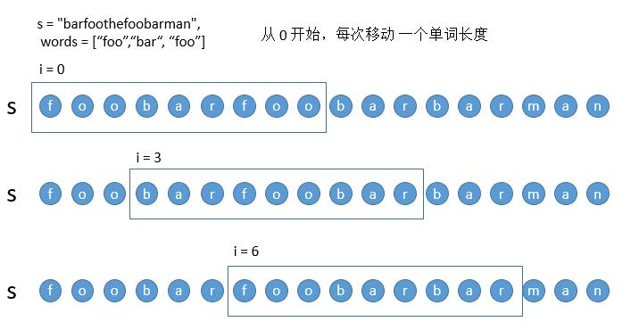
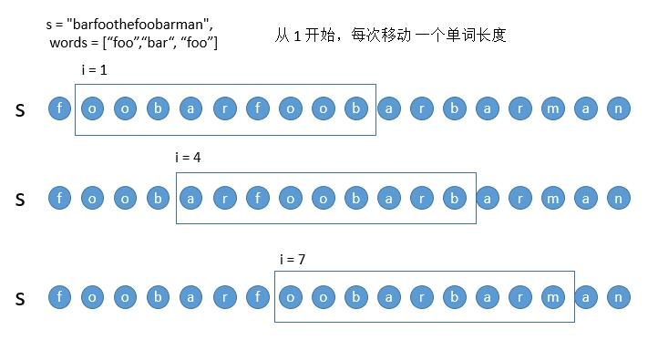
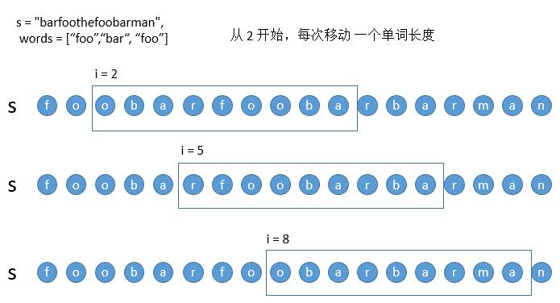

# 字符串
## [无重复字符的最长子串](3.py)
- [Link](https://leetcode-cn.com/problems/longest-substring-without-repeating-characters/)
- 给定一个字符串 s ，请你找出其中不含有重复字符的 最长子串 的长度
- 滑动窗口法!!!  重点在于滑动的流程,这个流程需要思考
- 定义num_count字典:保存字符出现次数,保证出现次数都<=1,
```python
def lengthOfLongestSubstring(self, s: str) -> int:
    '''无重复字符的最长子串
    
    @Note:
        滑动窗口法,进入这个队列（窗口）为 abc 满足题目要求，当再进入 a，队列变成了 abca，这时候不满足要求.将最左侧的元素移除
        字典:保存字符出现次数,保证出现次数都<=1,
    '''
    num_count={}#滑动窗口中各字符出现的个数
    l,r=0,0
    max_len=0
    for r in range(len(s)):
        if s[r] not in num_count:#累计次数
            num_count[s[r]]=0
        num_count[s[r]]+=1

        while num_count[s[r]]>1:#当出现重复的时候,从左往右去除不满足条件的值
            num_count[s[l]]-=1
            l+=1
        max_len=max(max_len,r-l+1)#当前满足条件的长
    return max_len
```
```python
def lengthOfLongestSubstring_2(self, s: str) -> int:
    '''无重复字符的最长子串
    
    @Note:
        最直观的求取每位的不重复子串长,然后求最大值,三重循环太长,去除一些重复取值情况
    '''
    lens=[len(s)-i for i in range(len(s))]#初始值为子串最大值
    for i in range(len(s)):
        start_j=1 if i==0 else i-1+lens[i-1]#去除一些重复取值情况
        for j in range(start_j,len(s)):
            if s[j] in s[i:j]:
                lens[i]=j-i
                break
            else:
                lens[i]=j-i+1
    return 0 if len(s)==0 else max(lens)
```
```python
def lengthOfLongestSubstring_3(self, s: str) -> int:
    '''无重复字符的最长子串
    
    @Note:
        最直观的求取每位的不重复子串长,然后求最大值,三重循环太长
    '''
    lens=[len(s)-i for i in range(len(s))]#初始值为子串最大值
    for i in range(len(s)):
        for j in range(i+1,len(s)):
            if s[j] in s[i:j]:
                lens[i]=j-i
                break
            else:
                lens[i]=j-i+1
    return 0 if len(s)==0 else max(lens)
```

## [最小覆盖子串](76.py)
- [Link](https://leetcode-cn.com/problems/minimum-window-substring/)
- 给你一个字符串 s 、一个字符串 t 。返回 s 中涵盖 t 所有字符的最小子串。如果 s 中不存在涵盖 t 所有字符的子串，则返回空字符串 ""
- 定义变量
  - need_cnt:滑动窗口中t字符还需要的个数
  - all_need_cnt:满足条件仍需要的个数(为了避免遍历need_cnt是否都为0)
- 当满足条件时，滑动窗口往外扔，进行下一次迭代
```python
def minWindow(self, s: str, t: str) -> str:
    '''最小覆盖子串
    
    @Note:
        滑动窗口,t存在重复字符的情况
    '''
    need_cnt={}#滑动窗口中t字符还需要的个数
    for t_char in t:
        if t_char not in need_cnt:
            need_cnt[t_char]=0
        need_cnt[t_char]+=1
    l,r=0,0
    min_len=len(s)
    ret=''
    all_need_cnt=len(t)#仍需要的个数才能满足条件
    for r in range(len(s)):
        if s[r] in need_cnt:
            if need_cnt[s[r]]>0:
                all_need_cnt-=1
            need_cnt[s[r]]-=1
        
        while all_need_cnt==0:#当满足条件时
            if r-l+1<=min_len:
                min_len=r-l+1
                ret=s[l:r+1]

            if s[l] in need_cnt:
                need_cnt[s[l]]+=1
                if need_cnt[s[l]]>0:
                    all_need_cnt+=1
            l+=1
    return ret
```

## [至多包含两个不同字符的最长子串](159.py)
- [Link](https://leetcode-cn.com/problems/longest-substring-with-at-most-two-distinct-characters/)
- 给定一个字符串 s ，找出 至多 包含两个不同字符的最长子串 t 
```python
def lengthOfLongestSubstringTwoDistinct(self, s: str) -> str:
    '''至多包含两个不同字符的最长子串'''
    char_count={}#滑动窗口中字符出现的次数
    l,r=0,0
    max_len=0
    ret=''
    for r in range(len(s)):
        if s[r] not in char_count:
            char_count[s[r]]=0
        char_count[s[r]]+=1

        while len(char_count)>2:#如果不满足条件
            char_count[s[l]]-=1
            if char_count[s[l]]==0:
                char_count.pop(s[l])
            l+=1

        if r-l+1>max_len:
            max_len=r-l+1
            ret=s[l:r+1]
    return ret
```

## [串联所有单词的子串](30.py)
- [Link](https://leetcode-cn.com/problems/substring-with-concatenation-of-all-words/)
- 给定一个字符串 s 和一些 长度相同 的单词 words 。找出 s 中恰好可以由 words 中所有单词串联形成的子串的起始位置。
- 注意子串要与 words 中的单词完全匹配，中间不能有其他字符 ，但不需要考虑 words 中单词串联的顺序。
- 
- 
- 
```python
def findSubstring(self, s: str, words: List[str]) -> List[int]:
    '''串联所有单词的子串，单词长度一致
    
    @Note:
        滑动窗口法,单词当作一个元素
    '''
    ret=[]
    word_len=len(words[0])
    for i in range(word_len):#单词长度内每位往后 单词长度
        all_need_cnt=len(words)#仍需要的个数才能满足条件
        word_count={}#滑动窗口还需要的次数
        for word in words:
            if word not in word_count:
                word_count[word]=0
            word_count[word]+=1
        l,r=i,i
        for r in range(i,len(s),word_len):
            this_word=s[r:r+word_len]
            if this_word in word_count:
                if word_count[this_word]>0:
                    all_need_cnt-=1
                    word_count[this_word]-=1

                    if all_need_cnt==0:#满足条件
                        ret.append(l)
                        old_word=s[l:l+word_len]#l往右平移
                        word_count[old_word]+=1
                        all_need_cnt+=1
                        l=l+word_len
                else:#当前单词出现次数过多
                    while s[l:l+word_len]!=this_word:#l往右平移
                        word_count[s[l:l+word_len]]+=1
                        all_need_cnt+=1
                        l+=word_len
                    l=l+word_len
            
            else:#当前单词不满足
                while l!=r:#之前的单词  #l往右平移
                    old_word=s[l:l+word_len]
                    word_count[old_word]+=1
                    all_need_cnt+=1
                    l+=word_len
                l+=word_len
    return ret
```
```python
def findSubstring_all(self, s: str, words: List[str]) -> List[int]:
    '''串联所有单词的子串，单词长度一致
    
    @Note:
        滑动窗口法,单词当作一个元素  穷举
    '''
    l,r=0,0
    ret=[]
    word_len=len(words[0])
    for r in range(len(s)):
        all_need_cnt=len(words)#仍需要的个数才能满足条件
        word_count={}#滑动窗口需要的次数
        for word in words:
            if word not in word_count:
                word_count[word]=0
            word_count[word]+=1
        for this_r in range(r,len(s),word_len):
            this_word=s[this_r:this_r+word_len]
            if this_word in word_count:
                if word_count[this_word]>0:
                    all_need_cnt-=1
                word_count[this_word]-=1
                if word_count[this_word]<0:
                    word_count[this_word]+=1
                    break
                if all_need_cnt==0:
                    ret.append(r)
            else:
                break
    return ret
```

## [最长公共前缀](14.py)
- [Link](https://leetcode-cn.com/problems/longest-common-prefix/)
- 编写一个函数来查找字符串数组中的最长公共前缀。如果不存在公共前缀，返回空字符串 ""。
```python
def longestCommonPrefix(self, strs: List[str]) -> str:
    '''最长公共前缀
    
    @Note:
        纵向比较
    '''
    if len(strs)==0:
        return ''
    for j in range(len(strs[0])):
        for i in range(1,len(strs)):
            if len(strs[i])<j+1 or strs[i][j]!=strs[0][j]:
                return strs[0][:j]
    return strs[0]#注意这,如果前面条件都满足,那么返回strs[0]
```

## [反转字符串中的元音字母](345.py)
- [Link](https://leetcode-cn.com/problems/reverse-vowels-of-a-string/)
- 编写一个函数，以字符串作为输入，反转该字符串中的元音字母
```python
def reverseVowels(self, s: str) -> str:
    '''反转该字符串中的元音字母
    
    @Note:
        类似快排，左右指针
    '''
    vowels = {'a', 'e', 'i', 'o', 'u', 'A', 'E', 'I', 'O', 'U'}
    i, j = 0, len(s) - 1
    s=list(s)
    while i<j:
        while i<j and s[i] not in vowels:
            i+=1
        while i<j and s[j] not in vowels:
            j-=1
        if i<j:
            s[i],s[j]=s[j],s[i]
        else:
            break
    return ''.join(s)
```

## [字符串转换整数](8.py)
- [Link](https://leetcode-cn.com/problems/string-to-integer-atoi/)
- 实现一个 myAtoi(string s) 函数，使其能将字符串转换成一个 32 位有符号整数（类似 C/C++ 中的 atoi 函数）。
- 函数 myAtoi(string s) 的算法如下：
  - 读入字符串并丢弃无用的前导空格
  - 检查下一个字符（假设还未到字符末尾）为正还是负号，读取该字符（如果有）。 确定最终结果是负数还是正数。 如果两者都不存在，则假定结果为正。
  - 读入下一个字符，直到到达下一个非数字字符或到达输入的结尾。字符串的其余部分将被忽略。
  - 将前面步骤读入的这些数字转换为整数（即，"123" -> 123， "0032" -> 32）。如果没有读入数字，则整数为 0 。必要时更改符号（从步骤 2 开始）。
  - 如果整数数超过 32 位有符号整数范围 [−231,  231 − 1] ，需要截断这个整数，使其保持在这个范围内。具体来说，小于 −231 的整数应该被固定为 −231 ，大于 231 − 1 的整数应该被固定为 231 − 1 。
  - 返回整数作为最终结果。
```python
def myAtoi(self, s: str) -> int:
    '''字符串转换整数 (atoi)'''
    if len(s)==0:#特例
        return 0
    ret=0
    i=0
    while s[i]==' ':#去' '
        i+=1
        if i==len(s):#特例
            return 0
    pos_neg=-1 if s[i]=='-' else 1#正负号
    if s[i] in ['-','+']:#如果是正负号往右走!!!
        i+=1
    near_overflow_data=2**31//10
    while i<len(s):
        if not s[i].isdigit():
            return pos_neg*ret
        
        int_char=int(s[i])
        # 溢出判断
        if ret>near_overflow_data or (ret==near_overflow_data and int_char>7):#数字部分超过2147483647那么是边界值
            return 2 ** 31 - 1 if pos_neg > 0 else -2 ** 31#-2147483648~2147483647

        ret=10*ret+int_char
        i+=1
    return ret*pos_neg
```

# TODO
## 滑动窗口
  - [长度最小的子数组](https://leetcode-cn.com/problems/minimum-size-subarray-sum/)
  - [滑动窗口最大值](https://leetcode-cn.com/problems/sliding-window-maximum/)
  - [字符串的排列](https://leetcode-cn.com/problems/permutation-in-string/)
  - [最小区间](https://leetcode-cn.com/problems/smallest-range/)
