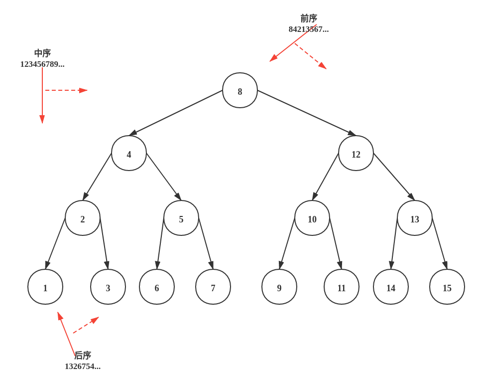

# 二叉树


1. **前序、中序、后序非递归:树从根开始，栈存到根，然后开始弹出，然后再存剩余的。**
2. **非递归,从root开始,把比较顺序写下,然后考虑如何用队列或栈实现这个顺序**
3. **画树，一般考虑1～3层递归即可**
4. **深度:递归、stack**
5. **广度:queue**
6. **是否存在、判断:递归**
7. **所有路径: 回溯: dfs(递归)+路径记录**
8. **递归看成:左子树也这么做,右子树也这么做,在做完之后考虑root、左子树结果、右子树结果进行逻辑联系**
9. **一些题目可以看成中序遍历的变种,进行中序遍历，记录头节点、上一节点指针，然后进行操作**

## [前序遍历](144.py)
- [Link](https://leetcode.cn/problems/binary-tree-preorder-traversal/)
- [参考](https://blog.csdn.net/zy_dreamer/article/details/131040301)
```c++
void preorder_traversal(TreeNode* node, std::vector<int>* vec) {
  if (!node) {
    return;
  }

  vec->emplace_back(node->val);
  preorder_traversal(node->left, vec);
  preorder_traversal(node->right, vec);
}

std::vector<int> preorder_traversal_1(TreeNode* root) {  // 前序  [根、左、右]
  std::vector<int> vec;

  preorder_traversal(root, &vec);  // 看成只有三个节点（根节点，左子树，右子树）的树，不需要展开，直接调用

  return vec;
}

std::vector<int> preorder_traversal(TreeNode* root) {  // 前序  [根、左、右]
  std::vector<int> vec;
  if (!root) {
    return vec;
  }

  std::stack<TreeNode*> s;
  s.emplace(root);

  while (!s.empty()) {  // 非递归 stack 栈顶 [根 - 左右]
    TreeNode* node = s.top();
    vec.emplace_back(node->val);
    s.pop();

    if (node->right) {
      s.push(node->right);
    }
    if (node->left) {
      s.push(node->left);
    }
  }

  return vec;
}
```

## [中序遍历](94.py)
- [Link](https://leetcode-cn.com/problems/binary-tree-inorder-traversal/)
```c++
void inorderTraversal(TreeNode* node, std::vector<int>* vec) {
  if (!node) {
    return;
  }

  inorderTraversal(node->left, vec);
  vec->emplace_back(node->val);
  inorderTraversal(node->right, vec);
}

std::vector<int> inorderTraversal_1(TreeNode* root) {  // 中序  [左、根、右]
  std::vector<int> vec;

  inorderTraversal(root, &vec);  // 看成只有三个节点（根节点，左子树，右子树）的树，不需要展开，直接调用

  return vec;
}

std::vector<int> inorderTraversal(TreeNode* root) {  // 后序  [左、根、右]
  std::vector<int> vec;
  if (!root) {
    return vec;
  }

  std::stack<TreeNode*> s;
  while (root || !s.empty()) {  // 非递归 stack 栈顶 [左根右], 在左子树访问之前, 当前节点不能提前出栈
    while (root) {              // 找到最左侧节点, 过程中push节点
      s.emplace(root);
      root = root->left;
    }

    TreeNode* node = s.top();  // 左子树访问完, pop
    s.pop();
    vec.emplace_back(node->val);
    root = node->right;  // 往右遍历
  }

  return vec;
}
```

## [后序遍历](145.py)
- [Link](https://leetcode-cn.com/problems/binary-tree-postorder-traversal/)
```c++
void postorderTraversal(TreeNode* node, std::vector<int>* vec) {
  if (!node) {
    return;
  }

  postorderTraversal(node->left, vec);
  postorderTraversal(node->right, vec);
  vec->emplace_back(node->val);
}

std::vector<int> postorderTraversal_1(TreeNode* root) {  // 后序  [左、右、根]
  std::vector<int> vec;

  postorderTraversal(root, &vec);  // 看成只有三个节点（根节点，左子树，右子树）的树，不需要展开，直接调用

  return vec;
}

std::vector<int> postorderTraversal_2(TreeNode* root) {  // 后序  栈顶 [左-右、根]
  std::vector<int> vec;
  if (!root) {
    return vec;
  }

  std::stack<TreeNode*> s;
  s.push(root);

  while (!s.empty()) {  // 栈顶 [根-右、左] 前序便历, 再reverse
    TreeNode* node = s.top();
    s.pop();
    vec.emplace_back(node->val);

    if (node->left) {
      s.emplace(node->left);
    }
    if (node->right) {
      s.emplace(node->right);
    }
  }

  std::reverse(vec.begin(), vec.end());

  return vec;
}

std::vector<int> postorderTraversal(TreeNode* root) {  // 后序  栈顶 [左-右、根]
  std::vector<int> vec;
  if (!root) {
    return vec;
  }

  std::stack<TreeNode*> s;
  TreeNode* last_pop = nullptr;
  while (root || !s.empty()) {  // 非递归 stack 栈顶 [左右根], 在左子树、右子树访问完之前, 当前节点不能提前出栈
    while (root) {      // 找到最左侧节点, 过程中push节点
      s.emplace(root);
      root = root->left;
    }

    TreeNode* node = s.top();
    if (node->right && last_pop != node->right) {  // 右子树访问完之前, last_pop: 保证右子树没访问过, 不然会重复遍历
      root = node->right;
    } else {  // 当前节点
      s.pop();
      vec.emplace_back(node->val);
      last_pop = node;
    }
  }

  return vec;
}
```

## [层序遍历](102.py)
- [Link](https://leetcode-cn.com/problems/binary-tree-level-order-traversal/)
```python
def levelOrder(self, root: TreeNode) -> List[List[int]]:
    '''队列'''
    if root is None:
        return []
    q=[root]
    ret=[]
    while q:
        size=len(q)#当前层的个数!!!
        t=[]
        for _ in range(size): # 当前层的个数, 遍历当前层
            node=q.pop(0)
            t.append(node.val)

            if node.left:
                q.append(node.left)
            if node.right:
                q.append(node.right)
        ret.append(t)
    return ret
```

## [**二叉树的所有路径**](257.py)
```python
def binaryTreePaths(self, root: TreeNode) -> List[str]:
    '''深度优先+路径记录'''
    path=[]#路径记录  全局变量，然后在dfs后pop最后一位
    ret=[]
    def dfs(root:TreeNode):
        if root is None:
            return
        path.append(str(root.val))# 前序
        if root.left is None and root.right is None:#输出  画1～3层的树
            ret.append('->'.join(path))

        dfs(root.left)
        dfs(root.right)
        path.pop()# 不pop的话path其实是前序遍历
    
    dfs(root)
    return ret
```

## [对称二叉树](101.py)
- [Link](https://leetcode-cn.com/problems/symmetric-tree/)
- 给定一个二叉树，检查它是否是镜像对称的
- **非递归,从root开始,把比较顺序写下,然后考虑如何用队列或栈实现这个顺序**
```python
def isSymmetric(self, root: TreeNode) -> bool:
    '''非递归,从root开始,把比较顺序写下,然后考虑如何用队列或栈实现这个顺序'''
    if root is None:
        return True
    s=[root.left,root.right]
    while s:
        node1=s.pop()
        node2=s.pop()
        if node1 is None and node2 is None:
            pass
        elif (node1 and node2 is None) or (node2 and node1 is None):
            return False
        else:
            if node1.val !=node2.val:
                return False
            s.append(node1.left)
            s.append(node2.right)
            s.append(node1.right)
            s.append(node2.left)
    return True

def is_symmetric(self, left:TreeNode ,right:TreeNode)->bool:
    '''左树是否镜像于右树'''
    if left is None and right is None:
        return True
    
    if left is not None and right is not None and left.val ==right.val and \
        self.is_symmetric(left.left,right.right) and self.is_symmetric(left.right,right.left):
        return True
    
    return False

def isSymmetric_1(self, root: TreeNode) -> bool:
    '''递归'''
    if root is None:
        return True
    return self.is_symmetric(root.left,root.right)
```

## [树的子结构](26.py)
- [Link](https://leetcode-cn.com/problems/shu-de-zi-jie-gou-lcof/)
- 输入两棵二叉树A和B，判断B是不是A的子结构。(约定空树不是任意一个树的子结构)
- B是A的子结构， 即 A中有出现和B相同的结构和节点值。
```python
def is_contain(self,A:TreeNode,B:TreeNode)->bool:
    '''B是否为A根节点相同的子树'''
    if B is None:#特别注意
        return True
    if A and B and A.val==B.val and\
        self.is_contain(A.left,B.left) and self.is_contain(A.right,B.right):
        return True
    return False

def isSubStructure(self, A: TreeNode, B: TreeNode) -> bool:
    if B is None:#None不是任何树的子树
        return False
    return self.is_contain(A,B) or (A is not None and (self.isSubStructure(A.left,B) or self.isSubStructure(A.right,B)))
```

## [翻转二叉树](226.py)
- [Link](https://leetcode-cn.com/problems/invert-binary-tree/)
```python
def invertTree(self, root: TreeNode) -> TreeNode:
    '''翻转二叉树'''
    if root is None:
        return root
    root.left,root.right=root.right,root.left
    self.invertTree(root.left)
    self.invertTree(root.right)
    return root
```

## [层序遍历II](107.py)
- [Link](https://leetcode-cn.com/problems/binary-tree-level-order-traversal-ii/)
- 从底向上的层序
```python
def levelOrderBottom(self, root: TreeNode) -> List[List[int]]:
    '''层次遍历的逆序'''
    if root is None:
        return []
    q=[root]
    ret=[]
    while q:
        size=len(q)# 当前层节点的个数
        t=[]
        for _ in range(size):
            node=q.pop(0)
            t.append(node.val)

            if node.left:
                q.append(node.left)
            if node.right:
                q.append(node.right)
        ret.append(t)
    return ret[::-1]
```

## [二叉树的右视图](199.py)
- [Link](https://leetcode-cn.com/problems/binary-tree-right-side-view/)
- 给定一个二叉树的 根节点 root，想象自己站在它的右侧，按照从顶部到底部的顺序，返回从右侧所能看到的节点值。
```python
def rightSideView(self, root: TreeNode) -> List[int]:
    '''层序遍历的最右侧'''
    if root is None:
        return []
    q=[root]#队列
    ret=[]
    while q:
        size=len(q)
        for i in range(size):
            node=q.pop(0)

            if i==size-1:
                ret.append(node.val)

            if node.left:
                q.append(node.left)
            if node.right:
                q.append(node.right)
    return ret
```

## [树的最大深度](104.py)
```python
def maxDepth(self, root: TreeNode) -> int:
    '''树的最大深度,递归。层次遍历也行'''
    if root is None:
        return 0
    return max(self.maxDepth(root.left),self.maxDepth(root.right))+1
```

## [树的最小深度](111.py)
```python
def minDepth(self, root: TreeNode) -> int: #注意跟最大深度的区别
    if root is None:
        return 0
    if root.left is not None and root.right is None:# 只有都左右节点都没有时才算叶子节点
        return 1+self.minDepth(root.left)
    if root.right is not None and root.left is None:
        return 1+self.minDepth(root.right)
    return 1+min(self.minDepth(root.left),self.minDepth(root.right)) #左右都有、左右都没有
```

## [路径总和](112.py)
- [Link](https://leetcode-cn.com/problems/path-sum/)
- 给你二叉树的根节点 root 和一个表示目标和的整数 targetSum ，判断该树中是否存在 **根节点到叶子节点** 的路径，这条路径上所有节点值相加等于目标和 targetSum 。
- 叶子节点 是指没有子节点的节点。
```python
def hasPathSum(self, root: TreeNode, targetSum: int) -> bool:
    if root is None:
        return False
    if root.val==targetSum:
        return True
    return self.hasPathSum(root.left,targetSum-root.val) or self.hasPathSum(root.right,targetSum-root.val)
```

## [路径总和II](113.py)
- [Link](https://leetcode-cn.com/problems/path-sum-ii/)
- 给你二叉树的根节点 root 和一个整数目标和 targetSum ，找出所有 **从根节点到叶子节点** 路径总和等于给定目标和的路径。
- 叶子节点 是指没有子节点的节点。
```python
def pathSum(self, root: TreeNode, targetSum: int) -> List[List[int]]:
    '''dfs+路径记录'''
    path=[]
    ret=[]
    def dfs(root,targetSum):
        if root is None:
            return
        
        path.append(root.val)
        if root.val==targetSum and root.left is None and root.right is None:
            ret.append(path.copy())#!!!!拷贝

        dfs(root.left,targetSum-root.val)
        dfs(root.right,targetSum-root.val)
        path.pop()
    dfs(root,targetSum)
    return ret
```

## [从前序与中序遍历序列构造二叉树](105.py)
- [Link](https://leetcode-cn.com/problems/construct-binary-tree-from-preorder-and-inorder-traversal/)
- 前序:根左右
- 中序:左根右
- **前序第一个为根节点,在中序查找根节点位置,左侧为左树,右侧为右树,根据左右树个数将前序分割,得到左右子树的前序**
```python
def buildTree(self, preorder: List[int], inorder: List[int]) -> TreeNode:
    '''可以考虑传递下标，减少数组拷贝的时间'''
    if len(preorder)==0:
        return None
    root_val=preorder[0]
    i=inorder.index(root_val)
    left_inorder=inorder[:i]
    right_inorder=inorder[i+1:]
    left_preorder=preorder[1:1+i] # 左子树前序、中序个数一样
    right_preorder=preorder[1+i:]

    return TreeNode(root_val,self.buildTree(left_preorder,left_inorder),self.buildTree(right_preorder,right_inorder))
```

## [从中序与后序遍历序列构造二叉树](106.py)
- [Link](https://leetcode-cn.com/problems/construct-binary-tree-from-inorder-and-postorder-traversal/)
- 中序:左根右
- 后序:左右根
```python
def buildTree(self, inorder: List[int], postorder: List[int]) -> TreeNode:
    '''传递下标'''
    index={}#元素在中序的下标
    for i in range(len(inorder)):
        index[inorder[i]]=i

    def build(inorder: List[int], postorder: List[int],i_l,i_r,p_l,p_r) -> TreeNode:
        if i_l>i_r:
            return None
        root_val=postorder[p_r]
        i=index[root_val]

        return TreeNode(root_val,build(inorder,postorder,i_l,i-1,p_l,p_l+(i-i_l-1)),\
                build(inorder,postorder,i+1,i_r,p_l+(i-i_l),p_r-1))
    return build(inorder,postorder,0,len(inorder)-1,0,len(postorder)-1)

def buildTree_1(self, inorder: List[int], postorder: List[int]) -> TreeNode:
    if len(postorder)==0:
        return None
    root_val=postorder[-1]
    i=inorder.index(root_val)

    left_inorder=inorder[:i]
    right_inorder=inorder[i+1:]
    left_postorder=postorder[:i]
    right_postorder=postorder[i:len(postorder)-1]#左闭右开!!
    return TreeNode(root_val,self.buildTree(left_inorder,left_postorder),self.buildTree(right_inorder,right_postorder))
```

## [验证二叉搜索树的后序遍历序列](33.py)
- [Link](https://leetcode-cn.com/problems/er-cha-sou-suo-shu-de-hou-xu-bian-li-xu-lie-lcof/submissions/)
```python
def verifyPostorder(self, postorder: List[int]) -> bool:
    '''左右根
    
    @Note:
        <,>,=
    '''
    if len(postorder)==0:
        return True
    root_val=postorder[-1]
    right_start=len(postorder)-1
    for i in range(len(postorder)-1):
        if postorder[i]>root_val:
            right_start=i
            break
    left_postorder=postorder[:right_start]
    right_postorder=postorder[right_start:len(postorder)-1]
    for i in range(right_start,len(postorder)-1):
        if postorder[i]<root_val:
            return False
    return self.verifyPostorder(left_postorder) and self.verifyPostorder(right_postorder)
```

## [二叉搜索树迭代器](173.py)
- [Link](https://leetcode-cn.com/problems/binary-search-tree-iterator/)
- 实现一个二叉搜索树迭代器类BSTIterator ，表示一个按中序遍历二叉搜索树（BST）的迭代器
```python
class BSTIterator:
    def __init__(self, root: TreeNode):
        def inorder(root)-> List:
            if root is None:
                return []
            l=inorder(root.left)
            r=inorder(root.right)

            ret=[]
            ret.extend(l)
            ret.append(root.val)
            ret.extend(r)

            return ret
        
        self.inorder_list=inorder(root)
        self.cur=0

    def next(self) -> int:
        ret=self.inorder_list[self.cur]
        self.cur+=1
        return ret

    def hasNext(self) -> bool:
        return self.cur<len(self.inorder_list)
```

## [二叉搜索树的最近公共祖先](235.py)
- [Link](https://leetcode-cn.com/problems/lowest-common-ancestor-of-a-binary-search-tree/)
- 1. 找到一条到节点1路径，找到一条节点2路径，顺序查找直到第一个不相等的数
- 2. **二叉查找树:<,=,>   从顶向下查找第一个在[p,q]之间的节点**
```python
def lowestCommonAncestor(self, root: 'TreeNode', p: 'TreeNode', q: 'TreeNode') -> 'TreeNode':
    '''二叉查找树:<,=,>   从顶向下查找第一个在[p,q]之间的节点'''
    if root.val>p.val and root.val>q.val:
        return self.lowestCommonAncestor(root.left,p,q)
    elif root.val<p.val and root.val<q.val:
        return self.lowestCommonAncestor(root.right,p,q)
    else:
        return root
```

## [二叉树的最近公共祖先](236.py)
- [Link](https://leetcode-cn.com/problems/lowest-common-ancestor-of-a-binary-tree/)
```python
def lowestCommonAncestor(self, root: 'TreeNode', p: 'TreeNode', q: 'TreeNode') -> 'TreeNode':
    path=[]
    ret=[]
    def dfs(root,p,q):
        if root is None:
            return
        
        path.append(root)
        if root.val==p.val or root.val==q.val:
            ret.append(path.copy())

        dfs(root.left,p,q)
        dfs(root.right,p,q)
        path.pop()
    
    dfs(root,p,q)
    ret_node=None
    for i in range(len(ret[0])):
        if ret[0][i]==ret[1][i]:
            ret_node=ret[0][i]
        else:
            break
    return ret_node
```

## [将二叉搜索树转换为单链表](17.12.py)
- [Link](https://leetcode-cn.com/problems/binode-lcci/)
- **递归看成:左子树也这么做,右子树也这么做,在做完之后考虑root、左子树结果、右子树结果进行逻辑联系**
- **一些题目可以看成中序遍历的变种,进行中序遍历，记录头节点、上一节点指针，然后进行操作**
```python
def convertBiNode(self, root: TreeNode) -> TreeNode:
    '''中序遍历:头节点、上一节点指针'''
    def dfs(root):
        if root is None:
            return
        dfs(root.left)
        if self.head is None:
            self.head=root#第一次调用的地方是头节点
        else:
            self.pre.right=root
        root.left=None
        self.pre=root
        dfs(root.right)
    self.head=None
    self.pre=None
    dfs(root)
    return self.head

def convertBiNode(self, root: TreeNode) -> TreeNode:
    if root is None:
        return None
    
    l=self.convertBiNode(root.left)#左子树也这么做，返回左子树结果
    r=self.convertBiNode(root.right)#右子树也这么做，返回右子树结果

    ret=l
    while l and l.right:
        l=l.right
    
    if l:
        l.right=root
    else:
        ret=root
    root.left=None
    root.right=r
    return ret
```

## [二叉搜索树与双向链表](426.py)
- [Link](https://leetcode-cn.com/problems/er-cha-sou-suo-shu-yu-shuang-xiang-lian-biao-lcof/)
- ~~递归看成:左子树也这么做,右子树也这么做,在做完之后考虑root、左子树结果、右子树结果进行逻辑联系.~~
- 中序遍历,头节点、上一节点
```python
def treeToDoublyList(self, root: 'Node') -> 'Node':
    def dfs(root):
        '''中序'''
        if root is None:
            return None
        
        dfs(root.left)
        if self.head is None:
            self.head=root#头节点
        else:
            self.pre.right,root.left=root,self.pre
        self.pre=root#上一节点
        dfs(root.right)
    
    self.pre=None
    self.head=None
    dfs(root)
    if self.head:
        self.head.left,self.pre.right=self.pre,self.head
    return self.head
```

## [填充每个节点的下一个右侧节点指针](116.py)
- [Link](https://leetcode-cn.com/problems/populating-next-right-pointers-in-each-node/)
- 层序遍历
```python
def connect(self, root: 'Node') -> 'Node':
    if root is None:
        return None
    
    q=[root]
    while q:
        size=len(q)
        last=None
        for _ in range(size):
            node=q.pop(0)
            if last:
                last.next=node
            last=node

            if node.left:
                q.append(node.left)
            if node.right:
                q.append(node.right)
    
    return root
```